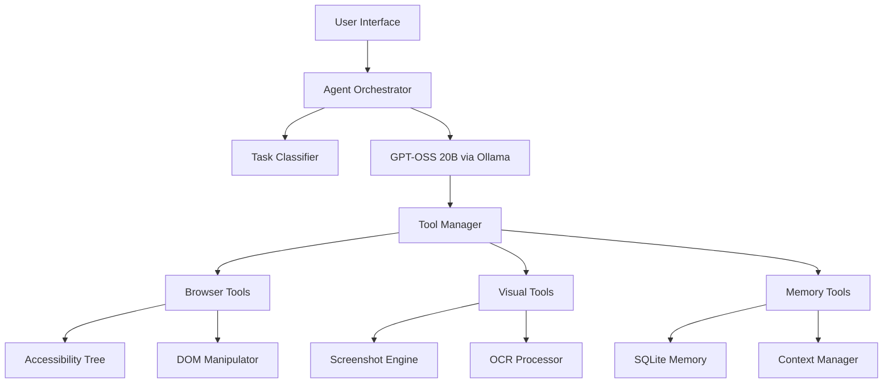

# AI Browser Architecture - Enhanced Design

## Overview

Based on comprehensive analysis of successful AI browsers (Perplexity Comet, BrowserOS), this document outlines the enhanced architecture for our local-first AI browser using GPT-OSS 20B.

## Core Architectural Principles

### 1. Privacy-First Design
- **Local Processing**: All AI inference happens locally via Ollama + GPT-OSS 20B
- **No Cloud Dependencies**: Unlike Comet (cloud-based), our browser keeps all data local
- **User Data Control**: Users own their conversation history, preferences, and AI interactions

### 2. BrowserOS-Inspired Integration Strategy
- **Phase 1**: Chrome Extension (current) - for rapid prototyping and testing
- **Phase 2**: Chromium Fork - for deep integration and production deployment
- **Rationale**: Extensions are limited by sandboxing; fork enables access to Accessibility Tree and native APIs

### 3. Agent-Centric Architecture
- **ReAct Pattern**: Reason → Act → Observe → Reason loops for multi-step tasks
- **Tool-Aware LLM**: GPT-OSS 20B trained with browser.search, browser.open, browser.click tools
- **Chain-of-Thought**: Transparent reasoning for debugging and user understanding

## System Components

### Core Infrastructure



### 1. Agent Orchestration Layer (`backend/main.py`)
**Purpose**: Central coordinator for all AI browser operations

**Components**:
- **FastAPI Server**: RESTful API + WebSocket streaming
- **Agent Router**: Routes requests to appropriate handlers
- **Context Builder**: Assembles page context + conversation history
- **Response Streamer**: Real-time AI response delivery

**Key Features**:
- 25+ API endpoints for complete browser automation
- WebSocket streaming for live updates
- Comprehensive error handling and logging
- Integration with all subsystems

### 2. Task Intelligence System (`backend/task_classifier.py`)
**Purpose**: Analyzes user requests to determine complexity and execution strategy

**Classifications**:
- **Simple**: Single action (click, navigate)
- **Moderate**: 2-3 actions with basic planning
- **Complex**: Multi-step workflows requiring orchestration
- **Ambiguous**: Requires clarification or context

**Features**:
- Intent analysis with confidence scoring
- Action suggestion generation
- Challenge identification and success criteria
- Integration with workflow planner

### 3. Visual Processing Engine (`backend/visual_processor.py`)
**Purpose**: Handles screenshots, OCR, and computer vision tasks

**Capabilities**:
- **Screenshot Capture**: Full page + element-specific screenshots
- **OCR Integration**: Tesseract, EasyOCR, PaddleOCR support
- **Layout Analysis**: UI element detection and classification
- **Visual Element Finding**: Computer vision-based element location

**Use Cases**:
- Reading text from images/PDFs
- Visual element highlighting and guidance
- Page layout understanding for AI

### 4. Form Intelligence System (`backend/form_intelligence.py`)
**Purpose**: Advanced form analysis and auto-fill capabilities

**Features**:
- **Field Type Detection**: Email, password, name, address, etc.
- **Form Classification**: Login, registration, checkout, contact, etc.
- **Auto-Fill Generation**: Smart suggestions based on context
- **Validation Rule Extraction**: Required fields, patterns, constraints
- **Completion Estimation**: Time and effort predictions

**Intelligence**:
- Pattern matching with confidence scoring
- Context-aware field labeling
- Multi-language support
- Privacy-conscious data handling

### 5. Memory Management System (`backend/context_memory.py`)
**Purpose**: Cross-tab context awareness and conversation persistence

**Architecture**:
- **SQLite Database**: Local storage for all context
- **Memory Scopes**: Session, tab, domain, global
- **Context Types**: Conversation, page visit, user action, form data
- **Relevance Scoring**: Smart context retrieval based on queries

**Features**:
- Conversation history across sessions
- User preference learning
- Task context preservation
- Smart memory cleanup and expiration

### 6. Visual Highlighting System (`backend/visual_highlighter.py`)
**Purpose**: DOM overlay and element highlighting for user guidance

**Capabilities**:
- **Dynamic Overlays**: CSS-based element highlighting
- **Style Variants**: Primary, success, warning, danger, info styles
- **Group Management**: Batch highlight operations
- **Action Overlays**: Visual guidance for next actions

**Integration**:
- Works with accessibility tree for precise targeting
- Coordinates with agent actions for visual feedback
- Supports pulsing animations and labels

### 7. Browser Automation Engine (`backend/browser_agent.py`)
**Purpose**: Core browser interaction and workflow execution

**Enhanced Features**:
- **Multi-Step Workflows**: Complex task orchestration
- **Error Recovery**: Automatic retry with exponential backoff
- **Action Validation**: Pre/post-condition checking
- **Accessibility Integration**: Smart element targeting
- **Workflow Management**: Pause/resume capabilities

**Tool Set**:
- Navigation, clicking, typing, scrolling
- Form filling with validation
- Content extraction and analysis
- Screenshot integration

### 8. Accessibility Integration (`backend/accessibility_tree.py`)
**Purpose**: Semantic page understanding via accessibility APIs

**Critical Insight**: BrowserOS identified this as essential for reliable element detection

**Features**:
- **Semantic Element Analysis**: Buttons, forms, headings, links
- **AI-Friendly Summaries**: Structured page descriptions
- **Smart Element Matching**: Natural language to DOM element mapping
- **Context Analysis**: Nearby elements and relationships

## Integration Strategy

### Phase 1: Extension-Based (Current)
**Status**: ✅ Complete
- Chrome extension with content scripts
- Local FastAPI backend via Ollama
- WebSocket communication for real-time features
- DOM-based element detection and manipulation

**Limitations**:
- Sandboxed environment restricts capabilities
- No access to Accessibility Tree API
- Limited autonomous operation
- Permission-dependent functionality

### Phase 2: Chromium Fork (Planned)
**Inspiration**: BrowserOS approach for deep integration
- Custom Chromium build with native AI integration
- Direct access to browser internals
- Built-in sidebar (not extension-based)
- Full Accessibility Tree access
- Native performance optimizations

**Benefits**:
- Unrestricted browser automation
- True autonomous operation
- Better user experience
- No extension permissions required

## Local LLM Architecture

### GPT-OSS 20B Integration
**Model Choice Rationale**:
- **Tool-Aware**: Trained with browser tools and function calling
- **Chain-of-Thought**: Transparent reasoning for debugging
- **Local Processing**: Privacy and cost advantages
- **Apple Silicon Optimized**: Efficient on Mac hardware

### Ollama Integration
**Runtime Strategy**:
- **HTTP API**: RESTful interface for model communication  
- **Streaming Support**: Real-time response generation
- **Model Management**: Easy switching between models
- **Memory Efficient**: 16GB RAM requirement for 20B model

### Tool Integration Pattern
```python
# Example tool calling sequence
user_request = "Book a restaurant for tonight"
system_prompt = build_system_prompt(tools=browser_tools, context=page_context)
llm_response = ollama_client.chat(system_prompt + user_request)
actions = parse_tool_calls(llm_response)
results = execute_actions(actions)
final_response = ollama_client.chat(system_prompt + user_request + action_results)
```

## Key Differentiators

### vs. Perplexity Comet
| Feature | Comet | Our Browser |
|---------|-------|-------------|
| Processing | Cloud-based | 100% Local |
| Privacy | Data sent to servers | All data stays local |
| Cost | Subscription required | Free after setup |
| Customization | Limited | Full control |
| Offline | No | Yes (after model download) |

### vs. BrowserOS  
| Feature | BrowserOS | Our Browser |
|---------|-----------|-------------|
| Model | Cloud APIs | Local GPT-OSS 20B |
| License | AGPL-3.0 | Apache-2.0 (planned) |
| Focus | General browsing | AI automation |
| Maturity | Alpha/Beta | Active development |

## Performance Considerations

### Model Performance
- **Inference Speed**: 2-4 tokens/sec on Apple Silicon
- **Memory Usage**: ~16GB for GPT-OSS 20B
- **Cold Start**: ~10 seconds for first request
- **Warm Inference**: <2 seconds for subsequent requests

### System Requirements
- **Minimum**: 16GB RAM, Apple Silicon Mac
- **Recommended**: 24GB+ RAM for optimal performance
- **Storage**: ~15GB for model + overhead
- **Network**: Only for initial model download

## Security & Privacy Architecture

### Data Handling
- **No Telemetry**: Zero data collection or transmission
- **Local Storage**: SQLite for all persistent data
- **Secure Contexts**: HTTPS requirements for sensitive operations
- **Sandboxed Processing**: Isolated AI inference environment

### User Control
- **Transparent Operations**: Clear visibility into AI actions
- **User Approval**: Confirmation for sensitive operations
- **Stop/Cancel**: Immediate termination of AI actions
- **Data Deletion**: Complete local data removal

## Future Extensions

### Planned Enhancements
1. **Computer Vision**: Advanced visual element detection
2. **Voice Interface**: Speech-to-text for hands-free operation
3. **Plugin System**: Third-party tool integration
4. **Multi-Model Support**: Switching between different LLMs
5. **Mobile Support**: iOS/Android app versions

### Integration Opportunities
1. **Obsidian/Notion**: Knowledge base integration
2. **Calendar Apps**: Automated scheduling
3. **Email Clients**: Smart email management
4. **Development Tools**: Code assistance and automation

## Implementation Status

### ✅ Completed (Current Session)
- Advanced task classification system
- Visual element highlighting engine  
- Intelligent form processing
- Cross-tab memory management
- Screenshot and OCR integration
- Comprehensive API architecture
- Enhanced documentation

### 🔄 In Progress
- ReAct orchestration patterns
- BrowserOS-style tool integration
- Advanced error recovery
- Performance optimizations

### 📋 Next Phase
- Chromium fork evaluation
- Native browser integration
- Advanced visual processing
- Production deployment strategies

This architecture represents a comprehensive approach to building a privacy-first, local-processing AI browser that can compete with commercial solutions while maintaining complete user control and transparency.